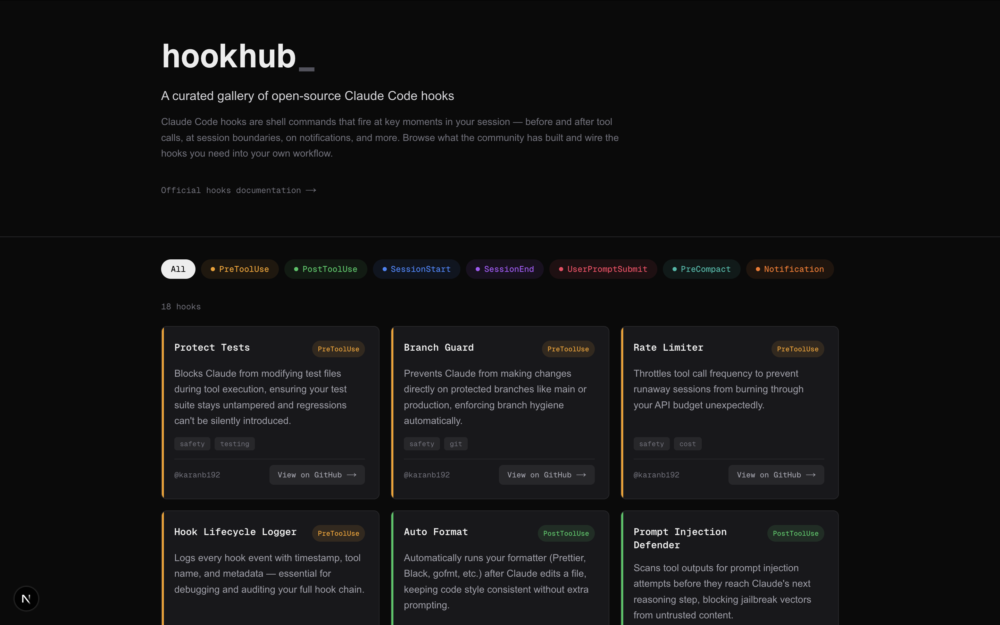

# hookhub

hookhub is a curated gallery of open-source Claude Code hooks. 

Claude Code hooks are shell commands that fire at key moments in your session — before and after tool calls, at session boundaries, on notifications, and more. Browse what the community has built and wire the hooks you need into your own workflow.

## 🖼️ Preview



## 🚀 Tech Stack

- **Framework**: [Next.js 16](https://nextjs.org) (App Router, Turbopack)
- **Library**: [React 19](https://react.dev)
- **Styling**: [Tailwind CSS v4](https://tailwindcss.com)
- **Language**: [TypeScript 5](https://www.typescriptlang.org)
- **Linting**: [ESLint 9](https://eslint.org)

## 🛠️ Getting Started

### Prerequisites

- Node.js 20+
- npm or your preferred package manager

### Installation

1. Clone the repository:
   ```bash
   git clone <repository-url>
   cd hookhub
   ```

2. Install dependencies:
   ```bash
   npm install
   ```

### Running Locally

Start the development server:

```bash
npm run dev
```

Open [http://localhost:3000](http://localhost:3000) in your browser to see the result.

## 📜 Available Commands

```bash
npm run dev      # Start development server
npm run build    # Build for production
npm run start    # Start production server
npx eslint .     # Lint the project
```

## 🔗 Useful Links

- [Official Claude Code Hooks Documentation](https://docs.anthropic.com/en/docs/claude-code/hooks)
